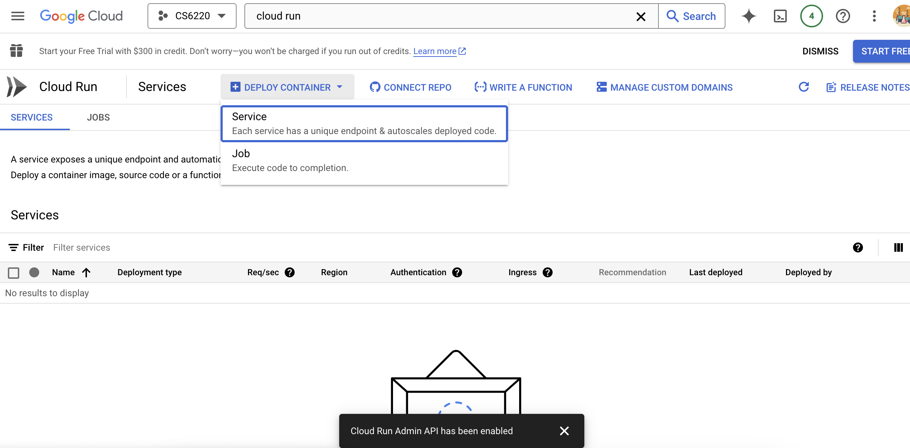
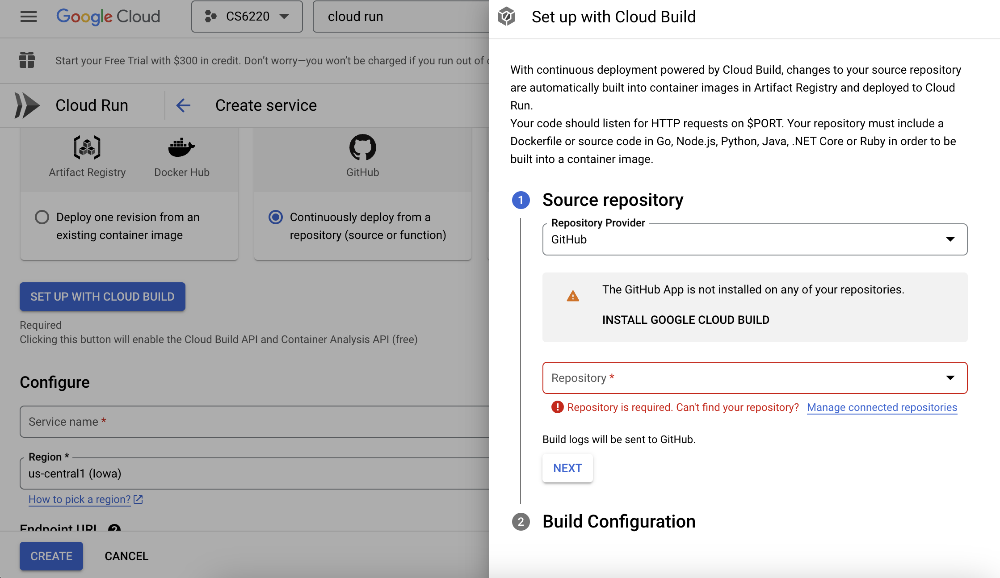
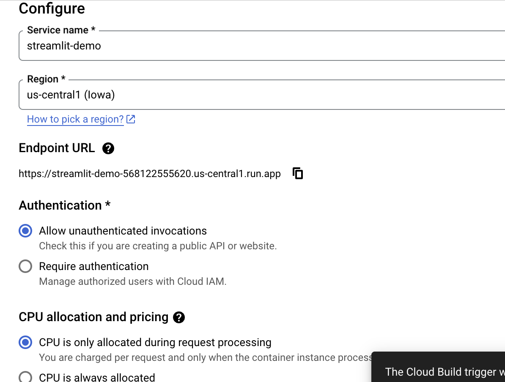

# Streamlit with Google Cloud Run

This code is forked from [mktaop](https://github.com/mktaop/cloudrun_demo), demo'ing a simple Streamlit App that Google can run on Cloud Run. His step by step video is [located here](https://www.youtube.com/watch?v=BGMdxpXsbB4).

### Cloud Run from Git Repo

1. Select / Search for Cloud Run, and Deploy Container (as Service) 
2. Deploy from git, and ensure the username is connected (validating your Git account). You may need to install Cloud Build for the repositories . Once Cloud Build is enabled for Git, you should be able to view all of your repositories. For "Build Type", select Dockerfile.
3. Specify the service. . For authentication, you can `Allow unauthenticated invocations` to enable this website to be accessed from the public. As well, you may wish to set CPUs to only be allocated per request (which means you're only charged when someone sends a request to your site).

### Locally on Docker

Build the container with the name `streamlit-example`.

```docker build -t streamlit-example .```

Run the container with the name `streamlit-runner`. The following will also create a home directory where you will be able to access the contents of this folder. Note that any change to the files in this folder (either in the repository or locally) will not be reflected in the running app. In order to affect the running app, you need to go to the folder `/app` in your Docker container, since the Dockerfile specified everything in this folder is copied there.

```docker run --name streamlit-runner -d -p 8090:8080 -p 80:80 -v $PWD:/home streamlit-example```

### On Virtual Machine without Docker

This route will have you spin a VM up, ensure it has right networking access, and then install / run the streamlit application. To do so, the steps are as follows.

1. Ensure VPC firewall rules exist. If not, do the following to create the rules
	1. VPC Network / Firewall / Create Firewall Rule
	1. Give it some target tag (e.g., `allow-9k-ingress` and `allow-9k-egress`)
	1. For both ingress and egress, create a rule: specify TCP ports (e.g, 0-9k) and all UDP ports (2 rules)
        1. Create a VM and add the target tags to networks (e.g., `allow-9k-ingress` and `allow-9k-egress`)
1. Virtual environment setup and install packages (unless you manage to install everything on the VM w/o it)
	1. Create the environment with `python3 -m venv stenv`
	1. Get into the virtual environment with `source stenv/bin/activate`
	1. Go into this cloned repository and run `pip install -r requirements.txt`
1. Edit your app.py and run `streamlit` at your desired port:
	1. `streamlit run app.py --server.port=XXXX`

The reason the majority of (2) exists above is because for some reason, pip doesn't work on VMs and it'll ask you to use a virtual environment.


### Requirements 

* You should have received $50 for student credit from GCP. Please see me immediately if you have not.
  - Feel free to review Lab 1 and Lab 2

* If any screen prompts you, make sure you have enabled Cloud Build API & Cloud Run Admin API.
